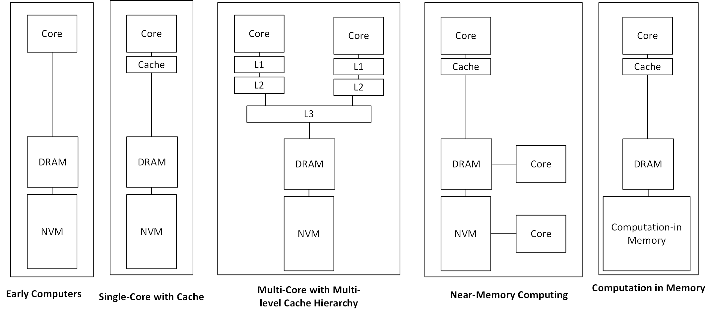
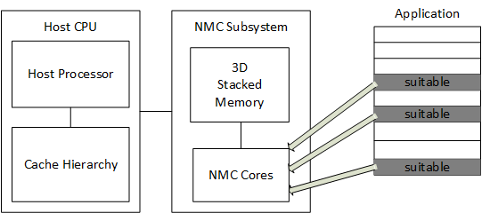

# Near Memory Computing: Past, Present, and Future
[reference](https://www.researchgate.net/publication/335028505_Near-Memory_Computing_Past_Present_and_Future)

The reason mentioned in this paper for moving toward these technologies is that conventional way of moving data to the CPU has become a significant performance bottleneck (energy consumption and access latency overheads). Processing in the home of the data can significantly diminish the data movement problem at data-intensive applications.

Three dimensional (3D) stacking is considered as the true enabler of processing close to the memory. It allows stacking logic and memory together using TSVs (Through-Silicon Vias). Some of these technologies:
- Micron's HMC (Hybrid Memory Cube)
- High bandwidth memory (HBM) of AMD and Hynix
- Samsung's wide I/O

The following figure shows the evolution of computing systems through the time from left to right.

**NOTE**: Conceptually, the approach of near-memory computing can be applied to any level or type of memory to improve the overall system performance.

NVM (Non-Volatile Memories) sometimes are termed as SCM (Storage Class Memories).

There were some work on in-disk computation, but because of its negligible performance imporvement, it is not considered serious.

## Background
First Near-Memory computing system was developed in 1990: Vector IRAM (VIRAM), a vector processor with a on-chip embedded DRAM to exploit data parallelism in multimedia applications. Although the performance obtained with this system was obtained, they did not pervail because of technological limits (the amount of the on-chip memory that could be integrated with the vector processor was limited due to the difference in logic and memory technology processes.). However, nowadays has changed completely.

## Processing Near Main Memory
- Programmable Unit (CPU, GPU)
- Fixed-Function Unit (ASIC)
- Reconfigurable Unit (FPGA)

## Processing Near Storage Class Memory
- Programmable Unit (CPU, GPU)
- Fixed-Function Unit (ASIC)
- Reconfigurable Unit (FPGA)
- 
## Challenges of Near-Memory Computing
- virtual memory support
  - software or hardware (hardware can be optimal instead of OS)
- Cache Coherence (which the architect's choice on this matter is going to influence the performance drastically)
  - Restricted region: dividing the memory into two parts: one for host processor (cachable), and another for the accelerator that is uncachable, or just caching in one block of the LLC to invalidate or write-back on the monitoring.
  - Non-restricted region: leading to a significant amount of memory traffic. A work proposed keeping a memory coherent between a host GPU and near-memory compute units, flushing the L2.
  - My point here is that keeping the memory consistent and coherent lies in the realm of coherence and consistency for heterogeneous systems. 
- Proramming Model
  - Compiler
  - Programmer
  - Sophisticated mechanisms touching from the application to instruction selection in compiler to invoke NMC logic units. Profiling applications to identify the potential for NMC acceleration

- Data Mapping

## Design Space Exploration for Near-Memory Computation
- Application Characterization -  knowing more about the application is crucial in adopting NMC to accelerate it
- Performance Evaluation Techniques
  - Analytic Models
  - Simulation-based Models: In the following list, simulators are listed
1. [Sinuca 2015](https://github.com/mazalves/sinuca)
2. [HMC-SIM 2016](https://github.com/tactcomplabs/gc64-hmcsim)
3. [CasHMC 2016](https://github.com/estwings57/CasHMC)
4. [SMC 2017](https://github.com/jiwon-choe/Brown-SMCSim)
5. CLAPPS 2017
6. [Ramulator-PIM 2019](https://github.com/CMU-SAFARI/ramulator-pim)

## Practicalities of Near-Memory Computation
Finally, the authors of the survey focus on their work to explain how they meet the challenges related to NMC. 

They depict their proposed system with NMC capability with an abstract view of application code with kernels that are offloaded to NMC as follows.
- For the 3D stacked memroy, they consider a 4GB HMC like design, with 8 DRAM layers, which each DRAM layer is split into 16 dual banked partitions with four vertical partitions forming a vault. Each vault has its vault controller.

Then, they characterize the application with the following metrics to detect the kernels that their offload to the NMC subsystem can result in performance improvement.

- **Memory Entropy**: It measures the randomness of the memory accesses. An application with higher entropy can benefit from NMC because the cache hierarchy are ineffective for them.
- **Spatial Locality**: They use the formula proposed by [X. Gu. et al.](https://dl.acm.org/doi/10.1145/1542431.1542446) for this purpose.
- **DLP**: It measures the average possible vector length and is relevant for for NMC when employing SIMD processing units as near-data computation unit. It is derived from ILP score per opcode such as load, store, etc. This metric represent the number of instructions with the same opcode that could run in parallel, thus expressing the DLP per opcode.
- **Basic block level Parallelism**: A basic block is the smallest component in the LLVM intermediate representation that can be parallelized. If an application jas high block-level parallelism, it can benefit from multiple processing units.

They use an open source software analysis tool with the above-listed metrics to analyze multi-thread applications from NMC perspective.

Then, a compilation process and programming model.