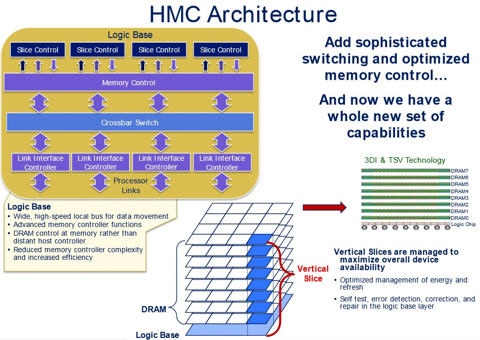

# PM: Power Modeling and Power Management for Processing-in-Memory
[Reference](https://www.semanticscholar.org/paper/PM3%3A-Power-Modeling-and-Power-Management-for-Zhang-Meng/da322ad439f4ad0c0ce852fd1c30f99979a2d492)

HPCA - 2018

## What is the problem the paper is trying to solve?
This paper tries to model the relationship between the power consumption and the internal bandwidth of PIM, which is not sufficiently investigated. This work not only provides a guide for PIM design, but also demonstrates the potential of power management **via bandwidth throttling**. Then, based on bandwidth throttling, authors propose three techniques for power and performance improvement (PAST (Power-Aware Subtask Throttling), PUB (Processing Unit Boost), PS (Power Sprinting)). It emphasizes that power consumption of PIM is an issue and should be studied comprehensively, and proposes a model.

A PIM working at its peak performance has potential power supply failure and memory reliability problems. Another issue is when data processing and corresponding memory accesses are not intensive (power supply is not fully utilized). The problem in these two cases become more severe when the power supply of memory is dynamically adapted by modern power management techniques (suitable for conventional processors and main memories).

## What are the key ideas of the paper? Key insights?
Power consumption really matters in PIM designs and should be considered and managed appropriately. So, A power model of PIM in relation to its internal bandwidth is needed. Then proposing 3 methods for power and performance improvement based on bandwidth throttling. Finally, concluding that RRAM (Resistive RAM) is more suitable for large processing-in-memory designs, due to its low power cost for storing data.

## The solution
### PAST (Throttling for meeting power budget)
The model estimates the PIM power consumption under various bandwidth, capacity and memory type. They model the power of PIM based on some parameters obtaining from regressing on some other works' experiments data. Then, based on this model, they porpose PAST ( Power Aware Subtask Throttling), a two-level power arbitrator for reducing the control intensity of a centeralized controller while providing felxible power control for different memory chips or banks. The L1 is responsible for arbitrating the execution of subtasks in a memory chip, and L2 holds the total power budget (sum of all L1s' budget). The power budget of an L1 can be increased or decreased by acquiring or releasing a portion of power from the L2 noting that the L1 power budget should not violate the thermal design power (TPD) designed for that memory chip, thus only a limit portion of power can be reallocated to the L1.

A subtask running inside a memory chip can be issued to be run when:
1. All its existing dependent subtasks have been completed.
2. The power requirement can be satisfied.

Hardware implementation overhead is negligible as proved by implementing it on FPGA showing that just 80 LUTs, 40 FFs, and 1 BRAM are used (less than 0.5% of the ZC702 FPGA chip).

 Their mechansim can be applied to different PIM design (3D Stacked or NVM-based).

### PUB - Processing Unit Boost (for better performance when internal bandwidth is not utilized appropriately because of low data-level parallelism)
PAST meets the power emergency problem. However, the power is underutilized because no enough PUs can work together, limited by the dependency among subtasks.

PUB is working based on PAST. It is desgined to boost the performance of these subtasks in critical paths, via dynamically adjusting the power mode of PUs. 

The baseline PUs contain two power modes: active, boost

The PUB can be taken as a kind of dynamic voltage and frequency scaling (DVFS) design, leveraging the charactersitics of PIM designs.

#### Simple PUB
This algorithm issues on subtask at a time, and because of potential frequent mode transition, it can be inefficient.

#### Advanced PUB
This approach is a greedy algorithm for power arbitration, based on the direct acyclic graph of the subtasks, working on a 3-state FSM:
- Ready: in initialization
- Update: triggered whenever a subtask finished, after updating, it will return back to Ready state
- Check: If any update happens, the state transfers to the Check state to determine the power modes of subtasks (a straightforward algorithm in paper)

The voltage of a PU in boost mode is 1.5X of the active mode voltage. The power consumption of boost is roughly 2X of the active, and the latency is reduced. The authors estimate that the latency in active mode is rougly 1.5X of the boost mode.

### Power Sprinting (PS)
There is a conflict between the fixed power supply and the changing power requirement to achieve an optimal energy-efficiency.

PS is proposed to to achieve better energy efficiency while supporitng flexible memory power allocations.

The basic idea of power sprinting (PS) is to provide power for a short period of time, and return back to under-loaded power status to recover noting that only the power cap is changed via providing **more current**. (Using big capacitor for this purpose)

The minimum recover time is the maximuim of time to recharge the extra power source for sprinting and to dissipate extra heat.

**NOTE**: The key factors that limits the capacity of power sprinting is the thermal capacitance of the package.

## Results
- 4.09X speedup with 10W and 8W PS (original PIM: 3.78X)
- 5.81X with 20W and 8W PS

## Strenghts
- Simple model
- Simple Implementation Overhead
- Negligible arbitrator latency (0.5 ns => assumed 1ns)
- 
## Weaknesses
- Regressing data for determining some parameters in their model, but we can ignore it becasue they can be set for each PIM based on its exact characteristics

## Comment
It was not only a really well- and simple-written paper, but also very informative for everybody wants to learn about PIM literature.

## New Idea
Nope!

**NOTE**: From the perspective of power, the **NVMs** are more suitable for PIM designs in the case of **large memroy capacity and low bandwidth usage**. The **3D stacked DRAM** is more suitable for PIM designs in the case of **small dataset and high bandwidth usage**.

---
## Notes For Learning
PIM has been introduced as a solution to accelerate data-intensive applications, such as **real-time Big Data processing** and **Neural Networks**. The acceleration of data processing using a PIM relies on its high internal memory bandwidth, which always comes with the cost of high power consumption. Consequently, it is important to have a comprehensive quantitive study of the power modeling and power management for such PIM architectures.

### RRAM (ReRAM): Resistive Random Access Memory
A type of NV (Non Volatile) RAM working by changing the resistance across a dialectric (A dielectric (or dielectric material) is an electrical insulator that can be polarized by an applied electric field.) solid-state material, often referred as memristor ( a non-linear two-terminal electrical component relating electric charge and magnetic flux linkage.). Memristor's resistance varies when different voltages are imposed across it. If a sample of dielectric material is subjected to a high enough voltage, it will suddenly conduct because of a phenomenon called dielectric breakdown. In a conventional dielectric material, breakdown causes permanent damage and failure of the associated component. **In a memristor, the dielectric breakdown is temporary and reversible because of the materials used**.

In one form of memristor, a deliberately applied voltage causes the medium to acquire microscopic conductive paths called **filaments**. The filaments appear as a result of various phenomena such as metal migration or physical defects. **Once a filament appears, it can be broken or reversed by the application of a different external voltage**. The controlled formation and destruction of filaments in large numbers allows for storage of digital data. Numerous substances have been tested for memristor characteristics, including nickel oxide, titanium dioxide, various electrolytes, semiconductor materials and even some organic compounds.

**ReRAM specifically works by using the method of creating physical defects in a layer of oxide material**. These defects are called **oxygen vacancies**, and the ReRAM works like a semiconductor but with oxygen ions; these vacancies represent two values in a binary system, instead of a semiconductors' electrons and holes.

#### Advantages
- **Higher switching speed** (~ 10 nano-seconds) compared to other NV memories, such as NAND flash (NAND compared to NOR provides slower reads, bit faster erase and writng new data, and offers higher storage capacity, and we know the goal is storage).
- Memristor filaments can occur in a few nanometers, promising **high storage density**.
- Less energy than NAND flash (better for industrial, automative and IoT applications) 

#### Disadvantages
- Occasional formation of unintended filaments (sneak(moving in a furtive or stealthy way) path)

Israeli firm Weebit Nano is developing ReRAM products based on silicon oxide, which means the ReRAM chips can be manufactured in existing fabs without having to retool the equipment.

Although ReRAM was initially seen as a replacement technology for flash memory, the cost and performance benefits of ReRAM have not been enough for companies to proceed with the replacement. Apparently, a broad range of materials can be used for ReRAM. However, the discovery that the popular high-κ gate dielectric HfO2 can be used as a low-voltage ReRAM has encouraged researchers to investigate more possibilities [From Wiki](https://en.wikipedia.org/wiki/Resistive_random-access_memory) - [Techtarger](https://searchstorage.techtarget.com/definition/RRAM-or-ReRAM-resistive-RAM#:~:text=RRAM%2C%20also%20known%20as%20ReRAM,specially%20formulated%20solid%20dielectric%20material.).

### 3D Stacked Memory and Logic
**Current trend in memory industry**: Combining DRAM dies together with standard CMOS dies via 3D stacking and **T**hrough **S**ilicon **V**ia (**TSV**).

**Representative Examples**:
1. Hybrid Memory Cube (HMC)
2. High Bandwidth Mmeory (HBM)
These representatives combine up to eight DRAM dies with one logic layer to construct a cube of stacked memory and logic. TSVs are used to connect and transmit data through these layers.

- HMC is designed to provide data links mainly for CPUs (for servers).
- HBM connects to the CPU or GPU via the silicon interposer.

According to the data released, a 4-link HMC cube consumes 11W power under full utilization of its 128GB/s IO bandwidth. Delivering a large amount of power to such a highly compact structure is challenging:
1. Because more chips are folded together, **the number of power pins is limited by a smaller footprint**, compared to DDRx SDRAM chips. The limitation to the power supply becomes increasingly severe if more chips are stacked. Since the power pins have already dominated the total number of pins, increasing the number of power pins will significantly increase the cost of the chip.
2. **Stacking multiple dies causes thermal challenge**. Since the thermal tolerance of the SDRAM is much lower than CMOS, the temperature roof is lower than that of processors, which leads to more harsh thermal control. Eckert et al showed that if a passive heat sink is used, the maximum power of an HMC cube should be 10W; otherwise, the DRAM has to be refreshed in double rate and the error rate may increase.

“It’s clear that HBM has become a memory of choice for AI.” Tien Shiah (senior manager of high-speed memory marketing for Samsung Semiconductor) said.

Following figures are gathered from web can be useful for having an idea what the HMC and the HBM are:

HMC

HBM

**NOTE**: As it is obvious in the figures, the HBM becasue of its interposer can provide faster connections with GPU/CPU rather than the HMC architecture.

### Processing-in-Memory
PIM is proposed for accelerating:
- Neural Networks
- Graph Processing
- Big Data Processing
- Real-time Analytics
- Sparse Matrix Multiplication
- In-Memory Databases
Instead of unnecessarily moving all data into the processors, PIM improves the performance by better utilizing the memory internal bandwidth.

**The Internal Bandwidth** refers to the bank level bandwidth which can be leveraged by these PIM designs. The CPU-Mem interface bandwidth refers to the memory bus bandwidth used by the host processor. In the following table memory bandwidth information is listed.

| Design Name   |      Size      |  Memory Type | Configuration | CPU-Mem Bandwidth | Internal BW | Used Internal BW |
|----------|-------------|------|--------|-------|--------|--------|
| [Tesseract](https://ieeexplore.ieee.org/document/7284059) |  128GB | HMC | dragonfly, 16 HMC cubes, 8 4-Gb-DRAM/cube | 640GB/s | 8.0TB/s| 3.7TB/s|
| [NDC](https://www.researchgate.net/publication/269302127_NDC_Analyzing_the_impact_of_3D-stacked_memorylogic_devices_on_MapReduce_workloads) |    256GB   |   HMC | daisy-chain, 64 HMC cubes, 8 4Gb-DRAM/cube | 320GB/s | 8.0TB/s | 3.4TB/s|
| [PRIME](https://ieeexplore.ieee.org/document/7551380) | 16GB |   RRAM | 533MHz IO bus, 8 chips/rank, 8 banks/chip | 8.5GB/s | 275.2GB/s | No show |

Two approaches to build PIM architectures
1. **3D-based PIM**: stacking processor and DRAM dies (HMC, HBM) using TSVs to connect them.
2. **NVM-based**: **relies on memory cells to carry out the computing task**. Resistive and multi-level cell features can be leveraged for operations.

For either 3D-based PIM or NVM-based PIM, it has been pointed out that the performance improvement of PIM relies on the high internal bandwidth usage. **However, the increased memory bandwidth inevitably leads to more power consumption, which must be managed properly**.

There are much work on power management of CPUs than PIM.

Simulators:
1. NVSim
2. Cacti-3DD
3. SMCSim
4. McPat
5. Micron SDRAM power calculator

**NOTE**:

In a nutshell, to improve the power consumption, DRAM is preferred when the bandwidth is high, while NVMs are preferred when the bandwidth is low.