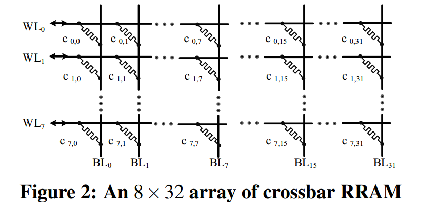

# RC-NVM: Enabling Symmetric Row and Column Memory Accesses for In-Memory Databases
[Reference](https://ieeexplore.ieee.org/document/8327034)

HPCA - 2018

## What is the problem the paper is trying to solve?
DRAM memory systems are suitable for row-based actions like operation from OLTP system, but OLAP systems because of the scanning operation they perform and their strided accesses can result in significant performance degradation.

## What are the key ideas of the paper? Key insights?
Finding that crossbar-based non-volatile memory (NVM) technologies, such as 3D XPoint, RRAM, and PCM, are promissing alternatives to support both row-oriented and column-oriented accesses with much lower area overhead, the authors design Row-Column-NVM (RC-NVM) that leverages the layout symmetry of crossbar-based NVM to enable fexible and efficient row and column accesses for IMDBs.

## The solution
A new NVM architecture for enabling row-based and column-based accesses while providing a simple addressing model with some changes to cache architecture for addressing data synonym and coherency issues. Employing group caching for mitigating the bad effect of accesses with a specific order, also cache pinning to solve the thrashing problem. 

## Results
- In best case, 14.5X memory access performance improvement compared to conventional NVM (RRAM)
- Area Overhead: 15% compared to conventional NVM

## Strenghts
- Hierarchical decoding structure effectively reduce the decoding delay and power when the proposed mechanism (RC-NVM) scales up.
- Considering coherence issue, when both row and column buffer ins the same bank are in use, by not allowing the row and column buffer to be active at the same time. If a row-column operation switch occurs, RC-NVM will close the active buffer and flush the data back, before it activates the new buffer.
- Simple dual addressing addressing model
- Considering the data synonym problem with a simple mechanism
- 

## Weaknesses
- They show area overheads of RC-NVM and DRAM, but when it comes to latency, they just mention their own laterncy overhead which is about 15% and it is because of cell access and writing delay!
- Not clear how they considered and compared the cache synonym and coherence overhead.

## Comment

## New Ideas?

---
## For learning
- Increaing DRAM capacity => development of In-Memory DataBases (IMDB)
- The integration of OLTP (On-Line Transactional Processing) and OLAP (On-Line Analytical Processing) systems is becoming a general trend.
- Conventional DRAM-based main memory is optimized for **row-oriented** accesses generated by OLTP workloads in row-based databases. OLAP queries scanning on specified columns cause so-called strided accesses and resul in poor memory performance. Since memory access latency dominates in IMDB processing time, it can degrade overall performance significantly.
- An in-memory database (IMDB) is a database system that keeps a significant part of data in main memory to achieve hgih query performance because nowadays disk-based databases fail to satisfy the needs of unltra-low latency services and real-time data analytics, and also DRAM technology provides high capacity with fair price.
- Examples of well-konwn IMDB research projects
  - MonetDB
  - H-Store/VoltDB
  - HyPer
  - Hyrise
-  Examples of commercial IMDBs
   -  Oracle TimesTen
   -  IBM SolidDB
   -  Microsoft Hekaton
   -  SAP HANA
- Database Workloads categorized in
  - OLTP: on-Line Transactional Processing => few access to several rows at a time
  - OLAP: on-Line Analytical Processing => bulk sequential scans spanning a few columns of the database, such as computing aggregate values of specific columns
- These two workloads are usually served by two different types of database systems:
  - Transactional Processing systems
  - Data Warehouse Systems
  - **Drawback of this approach**: 
    - At least two copies of data are resident in memory
    - Synchronization between two versions of data leads to the slow response time in analytics over real-time changing data
- In a nutshell, the integration of OLTP and OLAP database systems by means of in-memory technology has become a prevailing trend.
- Conventionally, data in physical main memory is stored with a row based layout is friendly to row-oriented access pattern in OLTP. However, for OLAP with column-oriented access patterns, it results in intensive so-called strided memory accesses that degrade memory efficiency due to poor row buffer and cache utilization.
- How to optimize memory architecture to facilitate both row-oriented and column-oriented data accesses has become a key instrunment in improving its performance.
- Spatial locality cannot be utilized in column-oriented access, and the size of two fields is smaller than the cacheline size, which further reduces the memory banwidth utilization.
- OLAP on row-based layout, or OLTP on column-based layout will cause strided memory accesses and degrade the cache line and DRAM row buffer utilization, which is harmful for memory system performance. None of them can perfectly support both OLTP and OLAP (i.e. OLXP) workloads.
- RC-DRAM area overhead is about 200% becasue of one more transistor per DRAM cell, extra word and bit lines, some additional peripheral circuits like row decoder, column decoder, sense amplifier etc.
- **Crossbar-based NVM**: Each RRAM cell lies at the cross-point of word lines (WLs) and bit lines (BLs). Without introducing access transistors, these cells are directly interconnected with WLs and BLs via electrodes. Read and Write operation can be performed by activating WLs and BLs with corresponding voltage. Since WLs and BLs are symmetric in such a crossbar array, reading out a column can be realized by simply exchanging behaviours of WLs and BLs. In the following figure, what is needed is exchanging the voltage on WLs and BLs accordingly. Then, the current on each WL is sensed to read out the target cells on the target column. Thus, compared to a RC-DRAM, we can achieve significantly smaller area overhead in a RC-NVM design.

- Used simulator
  - NVMain integrated with Gem5