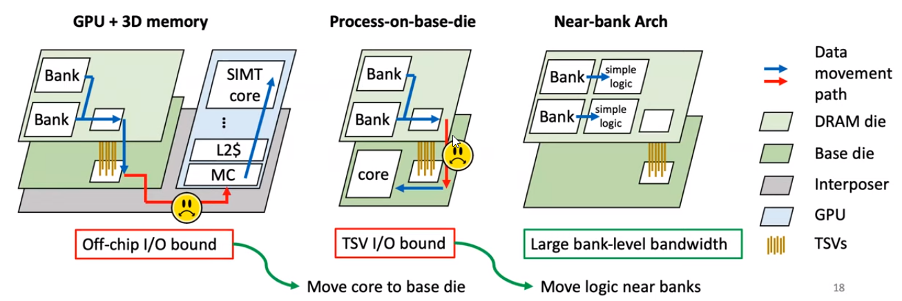
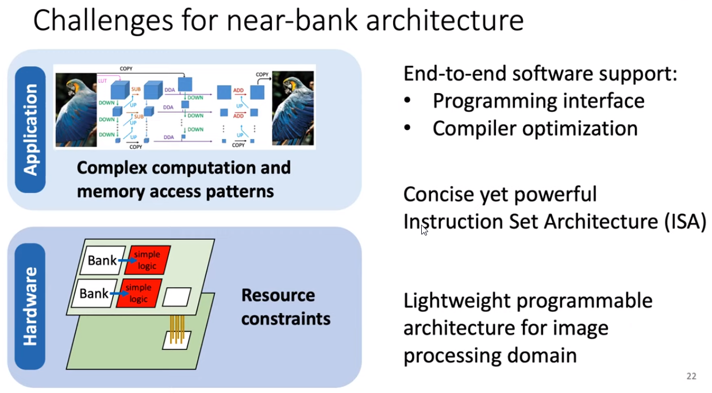
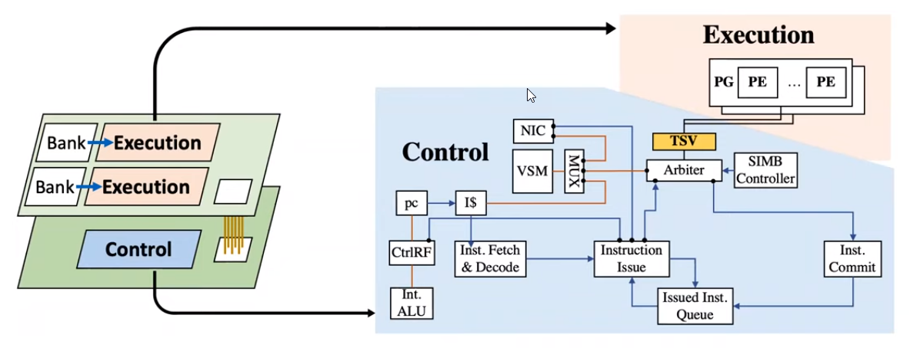

# iPIM: Programmable In-Memory Image Processing Accelerator Using Near-Bank Architecture
[Reference](https://ieeexplore.ieee.org/document/9138985)

[YouTube presentation link](https://www.youtube.com/watch?v=8YPCU3FHmOs)

ISCA - 2020

## What is the problem the paper is trying to solve?
Image processing workloads have high memory bandwidth demand:
- Software view:
  1. low arithmetic density
  2. difficulty of pipeline fusion because of wide and heterogeneous pipelines
- Hardware view:
  - On-chip cache cannot hold all intermediate data in these applications

GPU, which is the state-of-the-art accelerator for image processing, **suffers from the memory bandwidth bottlenck**. Additionally, memory bandwidth cannot solve with computation throughput
    - **Off-chip I/O**: increasing the number of I/Os is diffucult under tight area budget (limited off-chip pins)
    - **TSV I/O** (TSVs already consume ~18.8% DRAM die area for the current HBM2)

Also, increasing data rate will have signal integrity issues and increase power consumption as well.

## What are the key ideas of the paper? Key insights?
To tackle the memory bandwidth bottleneck of GPUs, **near-bank architecture** provides a promising solution (integrating computation logic closer to physical memory in order to increase memory bandwidth and reduce data movement energy) due to its **enormous bank-internal bandwidth** and **low-energy memory accesses**. However, previous work lacks hardware programability, while image processing workloads contain numerous heterogeneous pipeline stages with diverse computation and memory access patterns. Enbaling programmable near-bank architecture with low hardware overhead remain challenging.

The following figure shows the evolution to near-bank architecture:

In the following image, challenges of near-bank architecture is shown:

## The solution
A programmable in-memory image processing accelerator using near-bank architecture (3D-stacking near-bank architecture).
- First, Designing a decoupled control-execution architecture to provide lightweight programmability support.

- Second, Designing a single-instruction-multiple-bank (SIMB) ISA to enable flexible control flow and data access.
- Thrid, Presenting an end-to-end compilation flow based on **Halide** supporting a wide range of image processing applications and mapping them to the designed ISA (extending Halide frontend t support customized schedules for iPIM - using Halide schedules for pipeline fusion and vectorization on iPIM - adding two schedule primitives (utilizing the scratchpad of the processing group (PG))).
- Then, developing iPIM-aware compiler optimizations, including 1-(for Instruction Level Parallelsim objective) register allocation (register max spanning) for elimination because of original register allocation algorithm, instruction reordering (reducing the time for stalling for operation like memory accesses), and 2-(for DRAM buffer locality objective) memory order enforcement to improve performance (instruction re-order sometimes disrupt row buffer locality, so in order to evade this performance degradation cause, memory order enforcement is performed).

## Results
- 11.02X, 3.61 acceleration over an NVIDIA Tesla V100 GPU, and process-on-base-die solution
- 79.49%, 56.71% energy saving over an NVIDIA Tesal V100 GPU (coming from reduced expensive data movements), and process-on-die solution
- Area overhead of added components: 10.71%

## Strenghts
- The proposed architecture not only enables lightweight programmability to control heterogeneous pipeline stage (base logic die) but also supports parallel execution to provide abundant memory bandwidth for data-intensive image processing operations (PIM dies).
- Very comprehensive experiments for studying every technique they have applied

## Weaknesses

## Comment

## New Ideas?

---
## For learning
- Image processing workloads usually involve a large amount of **data-intensive computations**, thus motivating the design of domain-specific accelerators for both high performance and energy efficiency.
- The memory wall impedes GPU's further performance improvement as a result of both the characteristics of image processing and the limited bandwidth provided by the **compute-centric architecture**.
- Image processing applications require high memory bandwidth, since most of their pipeline stages have low arithmetic intensity. Even worse, its heterogeneous pipeline stages can hardly be joined due to the introduction of redundant computations and the degradation of parallelism.
- **The scaling of memory bandwidth provided by compute-centric architecture is hindered by both the limited number of off-chip pins and costly data movement energy**.
- 3D PIM have been shown that provides bandwidth advantages over GPU.
- To further unleash the bank-level bandwidth of 3D-PIM, the near-bank solution is proposed, which **closely integrates compute-logic to each bank in the DRAM dies**. It can provide 10X peak bandwidth improvement compared with the 3D-PIM because compute-logic directly accesses the local bank without going through limited TSVs (Through Silicon Vias).
- Challenges of near-bank architecture despite its potential:
    1. Heterogeneous image processing pipelines exhibit various computation and memory access patterns. Thus, requiring programmable hardware support. However, directly attaching control cores to each DRAM bank introduces large area overhead. So, it is challenging to design a lightweight architecture supporting diverse image processing pipelines.
    2. The design of ISA needs to be concise and poweful avoiding complex hardware support while enabling flexible computation, data movement, and control flow operations at the same time.
    3. End-to-end compilation support for this accelerator requires easy programming interfaces to enable the near-bank architecture, as well as backend optimizations to fully exploit the hardware potential.

### What is image processing pipeline?
It is a set of components used between an image source such as a camera, a scanner, or the rendering engine in a computer game, and an image renderer such as a television set, a computer screen, a computer printer or cinema screen, or for performing any intermediate digital image processing consisting of two or more separate processing blocks.

An image pipeline may be implemented in one of the following ways:
- Software
- DSP
- FPGA
- ASIC
- Analog Circuit

Typical goals of image pipeline:
- colorimetric precision
- noise reduction
- image scaling
- gamma correction
- image enhancement
- colorspace conversion
- chroma subsampling
- framerate conversion
- image compression (such as JPEG)
- computer data storage/ data transmission

[Link1 that should be considered](https://www.youtube.com/watch?v=mANUEfTyH3g&list=PLZ9qNFMHZ-A79y1StvUUqgyL-O0fZh2rs&index=2)

[Link2 that should be considered too](https://www.youtube.com/watch?v=PPLop4L2eGk&list=PLLssT5z_DsK-h9vYZkQkYNWcItqhlRJLN)