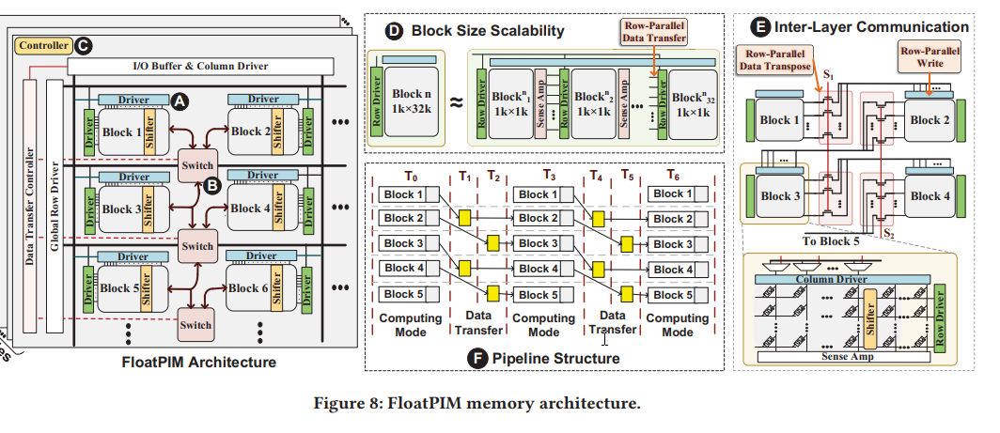
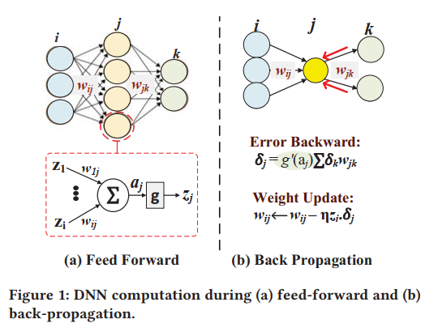
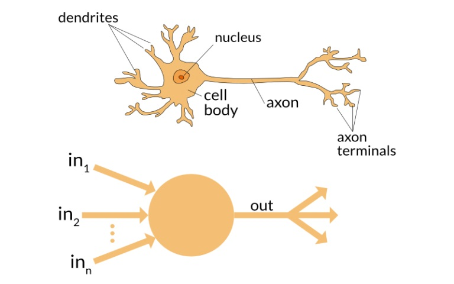
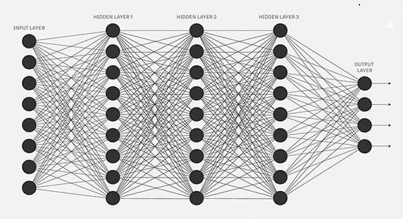
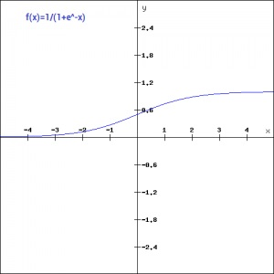
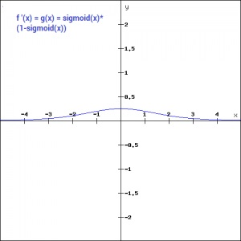
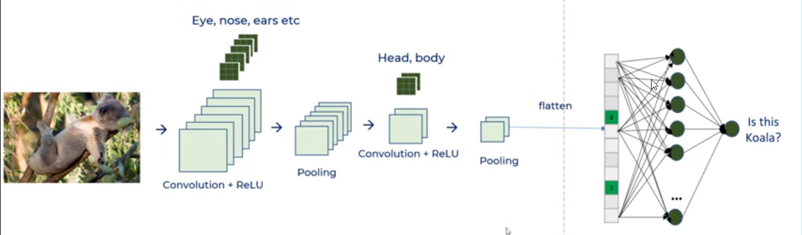

# FloatPIM: In-Memory Acceleration of Deep Neural Network Trainning with High Precision

[Reference](https://dl.acm.org/doi/10.1145/3307650.3322237)

[Youtube Presentation](https://www.youtube.com/watch?v=4zLaTZIue6k)

ISCA - 2019

## What is the problem the paper is trying to solve?
Existing PIM architectures do not support high precision computation, e.g., in floating point precision, which is essential for training accurate CNN models. Additionally, most of the existing PIM approaches require analog/mixed-signal circuits, which do not scale, exploiting insufficiently relaible multi-bit Non-Volatile Memory (NVM).

## What are the key ideas of the paper? Key insights?
Fully-digital (no ADC/DAC) scalable PIM architecture accelerating CNN in both training and testing phases, also enabling fast communication between neighbouring memory blocks to reduce internal data movement of the PIM architecture ensuring high precision with providing floating-point data types


## The solution


A digital and scalable processing in-memory architecture accelerating CNNs in both training and testing phases with precise floating-point computations. This architecture consists of multiple crossbar **memory blocks to which layers of neural network are mapped**.

**Each memory block represents a layer , and stores the data used in either testing (weights) or training (weights, the output of each neuron before activation, and the derivative of the activation function).**

With the stored data, the Float-PIM performs with two phases:
1. **Computing phase**: All memory blocks work in parallel, where each block processes **an individual layer** using PIM operations.
2. **Data transfer phase**: The memory blocks **transfer their outputs to the blocks corresponding to the next layers to proceed either the feed-forward or back-propagation**.

Each memory block supports in-memory operations for key CNN computations, including **vector-matrix multiplication**, **convolution**, and **pooling**.

FloatPIM architecture consists of 32 tiles where each tile has 256 crossbar memory blocks having **row and column drivers**. In each block, barrel shifters are exploited for supporting the convolution kernel. In both feed-forward and back-propagation switches are used to transfer data to neighboring blocks in parallel. There is a controller in each tile to calculate the loss function and control the row-driver, and column-driver, and switches for fast data transfer as follows.



Activation functions like sigmoid and ReLU are supported in memory. **These function are performed with a sequence of in-memory NOR operations due to the structure of digital NVM PIM architecture** (e.g., performing ReLU function by subtracting all neuron's output from the ReLU threhold value (THR), using **Taylor**; sigmoid using the PIM-based multiplication and addition based on Taylor expansion - This expansion is implemented in memory as a series of control signals).

FloatPIM does not use separate hardware modules for any layers but implements them using basic memory operations. Hence, with no changes to memory and minimal modifications to the architecture, FloatPIM can support the fusion of multiple layers.

Min/Max pooling operations (aiming at finding a maximum (minimum) values among the neuron's output in the previous layer) are implemented using **in-memory search operations** (using a crossbar memory with the capability of searching for the nearest value expoliting different supply voltages to give weight to different bitlines and enable the nearest search capability).

Additionally, FloatPIM provides hardwares for widely used operations like convolution kernel shiftings (by replacing the convolution with light-weight interconnect logic for the multiplication logic -> which in fact is a barrel shifter connecting two parts of the same memory) to gain high performance.

The feed-forward is fully performed inside memory by executing the basic PIM operations.

Furthermore, FloatPIM furhter accelerates the feed-forward and back-propagation by utilizing the parallelism of row/block-parallel PIM operations, considering that tasks can be parallelized for both feed-forward and back-propagation across a batch. It uses multiple data copies pre-stored in different blocks in memory.

For floating-point multiplication, sign bits are XORed, then exponent bits are added with multiple NOR operation, and multiplying mantissa bits from a previous work. Because of the sequentially of these operation, they are parallelized over all rows in the memory.

---


## Results
- using ImageNet dataset using popular large-scale neural networks
- 5.1% higher classification accuracy as compared to existing PIM architectures with limited fixed-point precision
- On training: 303.2X and 48.6X (4.3X and 15.8X) faster and more energ efficient over a GTX 1080 GPU (PipeLayer PIM accelerator)
- Testing: 324.8X and 297.9X (6.3X and 21.6X) speedup and efficiency compared to GPU (ISAAC PIM accelerator)

## Strenghts
- Both training and testing are accelerated

## Weaknesses
- Implementing some functionalities are peformed by inside PIM NOR operations.


## Comment

## New Ideas?

---
## For learning
- Processing CNNs in conventional Von Neumann architectures is inefficient as these architectures have separate memory and computing units.
- This paper provides a good introduction to DNN
- The following figure shows an example of NNs in a fully-connected layer, where each neuron is connected to all neurons in the previous layer. The computation of a single neuron can be seen (feed-forward pass). The outputs of the neurons in the previous layer are multiplied with the weight matrix, and the results are accumulated in each neuron, then the result of accumulation passes through an activation function (g). The activation results are used as the input for the neurons in the next layer.



---
### What is an activation function? why?
[reference](https://www.analyticsvidhya.com/blog/2020/01/fundamentals-deep-learning-activation-functions-when-to-use-them/)

**When our brain is fed with a lot of information simultaneously, it tries hard to understand and classify the information into “useful” and “not-so-useful” information. We need a similar mechanism for classifying incoming information as “useful” or “less-useful” in case of Neural Networks. This is important in the way a network learns because not all the information is equally useful. Some of it is just noise. This is where activation functions come into picture. The activation functions help the network use the important information and suppress the irrelevant data points.**

---
#### A very short tutorial on NNs from the aforementioned reference

 A neural network is **a very powerful machine learning mechanism** which basically mimics how a human brain learns.

The brain receives the stimulus from the outside world, does the processing on the input, and then generates the output. As the task gets complicated, multiple neurons form a complex network, passing information among themselves.



An Artificial Neural Network tries to mimic the behaviour of human behaviour. The network in the following figure is a neural network made of interconnected neurons. **Each neuron is characterized by its weight, bias and activation function**.


 
 The input is fed to the input layer, the neurons perform a linear transformation on this input using the **weights** and **biases**.

```
 X = (Weight * Input) + Bias
```

 Then, an activation function is applied on the above result.

Finally, the output from the activation functions moves to the next hidden layer and the same process is repeated. This forward movement of information is known as the **Forward Propagation** or **Feed Forward**.

In addition, using the output of the forward propagation, **error is calculated. Based on the error value, the weights and biases of the neurons are updated**. This process is called **Back Propagation**. 

**Note**: For more information on forward and back propagation [this link](https://www.analyticsvidhya.com/blog/2020/07/neural-networks-from-scratch-in-python-and-r/) is studied and summarized in the following after activation functions.

---

Imagine a neural network without the activation functions. In that case, every neuron will only be performing a linear transformation on the inputs using the weights and biases. Although linear transformations make the neural network simpler, but this network would be less powerful and will not be able to learn the complex patterns from the data.

**A neural network without an activation function is essentially just a linear regression model.**

Thus, we use a **non-linear transformation** to the inputs of the neuron and **this non-linearity in the network is introduced by an activation function**.

## Popular types of activation functions and when to use them
### Binary Step Function
```
F(x) = 1, x >=0
     = 0, x < 0
```

- This is **the simplest** activation function
- **Usage**: creating a binary classifier
- **Downside 1**: This function will not be useful when there are multiple classes in the target variable.
- **Downside 2**: Gradients are calculated to update the weights and biases during the backprop process. Since the gradient of the function is zero, the weights and biases don’t update.

### Linear Function
F(x) = ax

With this activation function, the weights and biases will be updated during the backpropagation process but the updating factor would be the same.

- **Drawback**: the neural network will not really improve the error since the gradient is the same for every iteration. The network will not be able to train well and capture the complex patterns from the data.

### Sigmoid Function
F(x) = 1 / (1 + e<sup>-x</sup>)



- One of the most widely used non-linear activation functions.
- Transforms the values between 0 and 1.

```python
import numpy as np
def sigmoid_function(x):
    z = (1/(1 + np.exp(-x)))
    return z
```
The derivitive of this function is:

F'(x) = sigmoid(x) * (1 - sigmoid(x))



- The gradient values are significant for range -3 and 3 but the graph gets much flatter in other regions. This implies that for values greater than 3 or less than -3, will have very small gradients. As the gradient value approaches zero, the network is not really learning.
- The gradient values are significant for range -3 and 3 but the graph gets much flatter in other regions. This implies that for values greater than 3 or less than -3, will have very small gradients. As the gradient value approaches zero, the network is not really learning.

### Tanh Function
tanh(x)=2sigmoid(2x)-1

```python
def tanh_function(x):
    z = (2/(1 + np.exp(-2*x))) -1
    return z
```

The derivative of tanh(x):

Tanh'(x) = 1 - tanh<sup>2</sup>(x)

- The gradient of the tanh function is steeper as compared to the sigmoid function.
- **Usually tanh is preferred over the sigmoid function since it is zero centered and the gradients are not restricted to move in a certain direction.**

### ReLU
f(x)=max(0,x)

- Stands for **R**ecified (= corrected, purified) **L**inear **U**nit
- **The main advantage of using the ReLU function over other activation functions is that it does not activate all the neurons at the same time.** For the negative input values, the result is zero, that means the neuron does not get activated.
- **Advantage**: Since only a certain number of neurons are activated, the ReLU function is far more computationally efficient when compared to the sigmoid and tanh function.
```python
def relu_function(x):
    if x<0:
        return 0
    else:
        return x
```
The derivative of ReLU activation function:
```
f'(x) = 1, x>=0
      = 0, x<0
```
- **Drawback**:  Due to the zero value of the gradient at the negative side, during the backpropogation process, the weights and biases for some neurons are not updated. This can create **dead neurons** which never get activated. 

### Leaky ReLU
```
f(x) = 0.01x, x<0
     =     x, x>=0
```
- An improved version of the ReLU function
```
f'(x) = 1, x>=0
     =0.01, x<0
```
So, no dead neurons any more. However, there are other approaches to avoid dead neurons such as parameterised, and exponential linear unit.

### Swish
```
f(x) = x*sigmoid(x)
f(x) = x/(1-e^-x)
```
- Discovered by Google researchers
- An computationally efficient as ReLU
- Better performance than ReLU for deeper models

```python
def swish_function(x):
    return x/(1-np.exp(-x))
```

**Note**: The curve of the function is smooth and the function is differentiable at all points. This is helpful during the model optimization process and is considered to be one of the reasons that swish outoerforms ReLU.

### Softmax
- Described as a combination of multiple sigmoids.
- Widely used for binary classification problems.
- The softmax function can be used for multiclass classification problems. This function returns the probability for a datapoint belonging to each individual class. 
```python
def softmax_function(x):
    z = np.exp(x)
    z_ = z/z.sum()
    return z_
```
### Finally, which one to choose?
Depending upon **the properties of the problem** we might be able to make a better choice for **easy and quicker convergence of the network**.

1. Sigmoid functions and their combinations generally work better in the case of **classifiers**
- Sigmoids and tanh functions are sometimes avoided due to the vanishing gradient problem
**ReLU function is a general activation function and is used in most cases these days**
If we encounter a case of dead neurons in our networks the leaky ReLU function is the best choice
- Always keep in mind that ReLU function should only be used in the hidden layers
As a rule of thumb, you can begin with using ReLU function and then move over to other activation functions in case ReLU doesn’t provide with optimum results

### Back Propagation

### Convolution

### Pooling
Pooling layer is used in CNNs to reduce the size of array, hence reducing the computation. In CNNs, convolution is used to extract features. then in pooling the size is reduced and as a result the amount of computation is reduced. The pooling and convolutional operations look like shifting a stencil over a matrix and finding the maximum in that stencil, the paper in-memory search operations and circuit shifters are designed for this purpose.

In the following image, which is a screenshot from [here](https://www.youtube.com/watch?v=zfiSAzpy9NM), a CNN can be observed.



The main idea behind CNN is feature extraction because the second part is same as a simple artificial neural network. By using the convolution, the features are extracted and also dimensions are reduced, which finally result in reduced computation.

Benefits of Convolution:
1. Connections sparsity reduces overfitting
2. Convolution + pooling gives location invariant feature detection
3. Parameter sharing

### Taylor expansion
---

I have to learn more about neural networks and machine learning