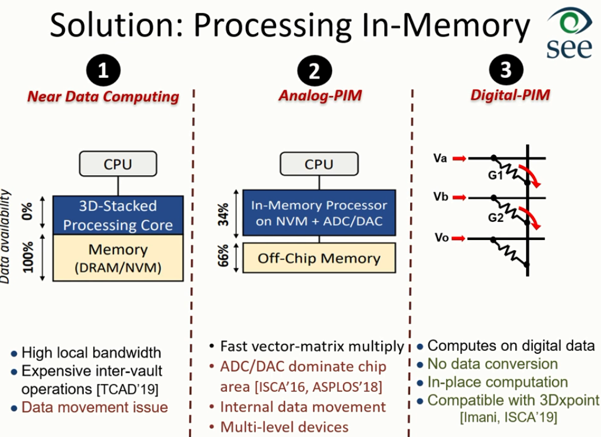
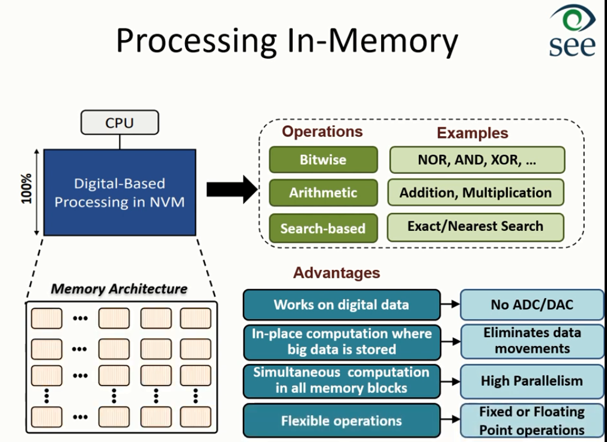

# FloatPIM: In-Memory Acceleration of Deep Neural Network Trainning with High Precision

[Reference](https://dl.acm.org/doi/10.1145/3307650.3322237)

[Youtube Presentation](https://www.youtube.com/watch?v=4zLaTZIue6k)

ISCA - 2019

## What is the problem the paper is trying to solve?
Existing PIM architectures do not support high precision computation, e.g., in floating point precision, which is essential for training accurate CNN models. Additionally, most of the existing PIM approaches require analog/mixed-signal circuits, which do not scale, exploiting insufficiently relaible multi-bit Non-Volatile Memory (NVM).

## What are the key ideas of the paper? Key insights?
Fully-digital (no ADC/DAC) scalable PIM architecture accelerating CNN in both training and testing phases, also enabling fast communication between neighbouring memory blocks to reduce internal data movement of the PIM architecture

## The solution

## Results
- using ImageNet dataset using popular large-scale neural networks
- 5.1% higher classification accuracy as compared to existing PIM architectures with limited fixed-point precision
- On training: 303.2X and 48.6X (4.3X and 15.8X) faster and more energ efficient over a GTX 1080 GPU (PipeLayer PIM accelerator)
- Testing: 324.8X and 297.9X (6.3X and 21.6X) speedup and efficiency compared to GPU (ISAAC PIM accelerator)

## Strenghts

## Weaknesses

## Comment

## New Ideas?

---
## For learning
